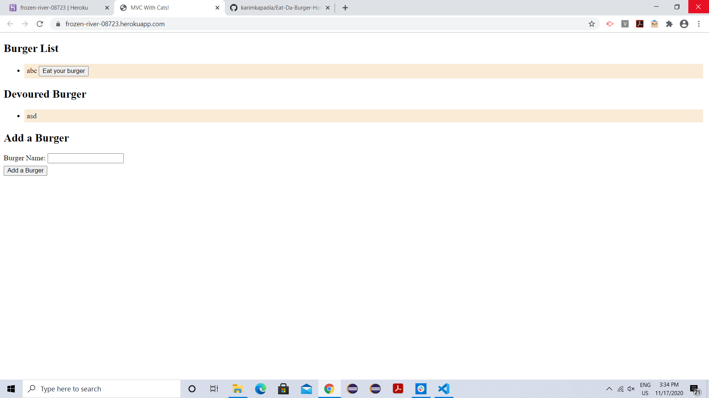
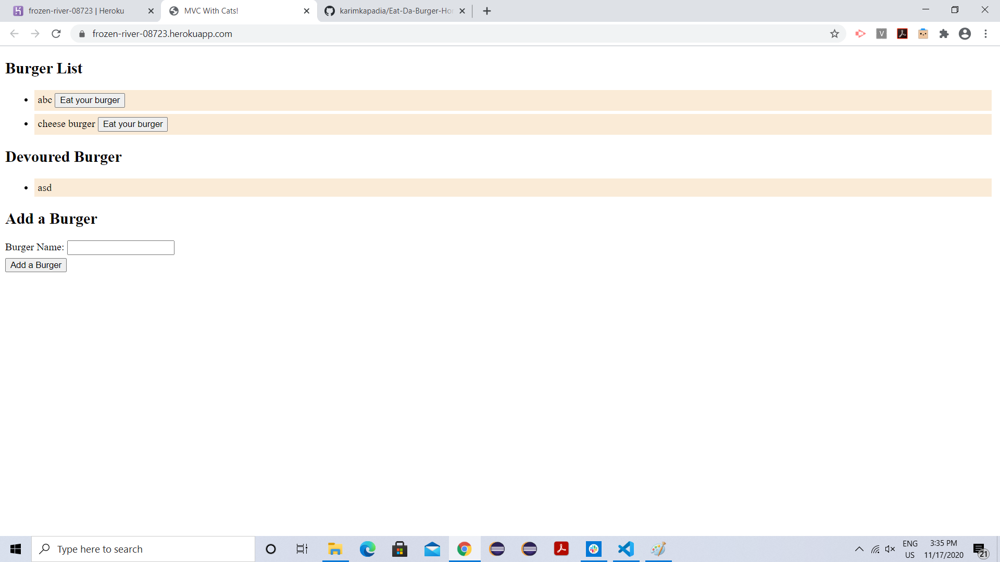
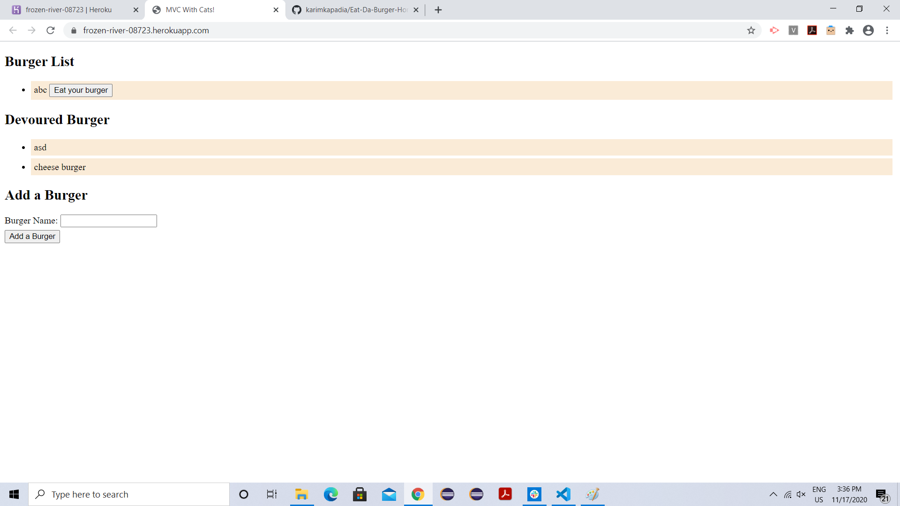

# Eat-Da-Burger-Homework-13
This application is a burger logger with MySQL, Node, Express, Handlebars and a ORM. It follows MVC design pattern and uses Node and MySQL to query and route data in app, and Handlebars to generate HTML.

# images

# Links
Heroku deployed link : https://frozen-river-08723.herokuapp.com/
Github link: https://github.com/karimkapadia/Eat-Da-Burger-Homework-13
